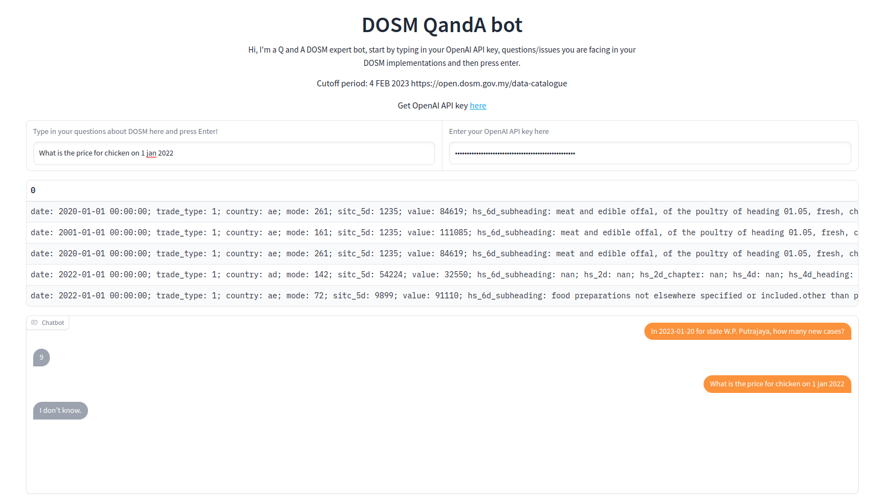

## ChatDOSM

Can ask any question related to DOSM data

SETUP

1. download embeddings.zip http://gofile.me/72cUv/p7lOkrbZL (pass:dosm)
2. extract embeddings.zip
3. go to your env if want to use env
3. pip install -r requirements.txt
4. python 03_build_map.py
4. python 04_build_index.py
5. python app.py

My pipeline:

1. Scrape using 01_scrape.py

1. Then clean the csv file into their own group with 01.5_clean.ipynb

1. Create embeddings using openai ada embeddings in 02_create_embeddings.py

1. Build mapping between index and file+row for embeddings in 03_build_map.py

1. Build index using faiss 04_build_index.py

1. Run gradio web app in app.py

I'm too lazy to clean up my code, feel free to ask question if you don't understand my code.

At first want to deploy in huggingface spaces, but embeddings too big and too lazy to store in cloud like pinecone.
Feel free to improve my prompt incase you want to do other stuff like visualization.